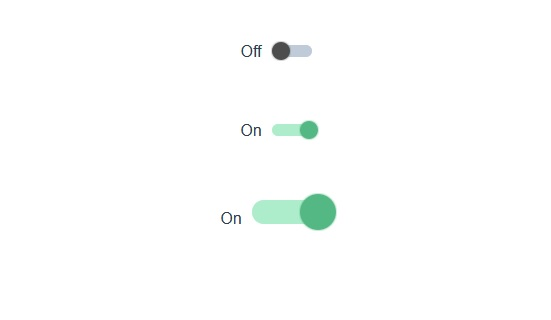

# Toggle input

```html
<toggle-input
    label-enable-text='On' 
    label-disable-text='Off' 
    :default-state="0"
    :form-inputs="{additionFormInput_:1 additionFormInput_2:2}" 
    url="/path/to/update" />
```

`url` url for updating column

`form-inputs` object of additional form data

`label-enable-text` Text when toggle is on

`label-disable-text` Text when toggle is off

`default-state`  default toggle state

